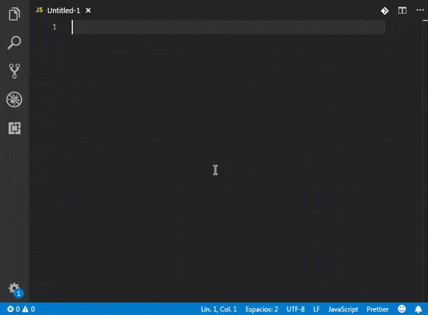

# Voxa Framework Snippets

This extension provides you code snippets for [Vs Code](https://code.visualstudio.com/) to speed up your Alexa skills development using the [Voxa Framework](http://voxa.ai/) made by [RAIN](https://rain.agency/).


## Usage



## Installation

Search for "Voxa Framework Snippets" in the VS Code extensions tab.

## Snippets

Every space inside `{ }` means that this is pushed into next line.

`$` represent each step after `tab`.

## State and Intent

|  Prefix               | Method                                                                   |
| --------------------: | ------------------------------------------------------------------------ |
|       `onintentVoxa→` | `$1:skill.onIntent('$2', ($3:alexaEvent) => { $4 });`                    |
|   `launchintentVoxa→` | `$1:skill.onIntent('LaunchIntent', ($2:alexaEvent) => { $3 });`          |
|     `helpintentVoxa→` | `$1:skill.onIntent('AMAZON.HelpIntent', ($2:alexaEvent) => { $3 });`     |
|   `repeatintentVoxa→` | `$1:skill.onIntent('AMAZON.RepeatIntent', ($2:alexaEvent) => { $3 });`   |
|`startoverintentVoxa→` | `$1:skill.onIntent('AMAZON.StartOverIntent', ($2:alexaEvent) => { $3 });`|
|        `onstateVoxa→` | `$1:skill.onState('$2', ($3:alexaEvent) => { $4 });`                     |
|          `entryVoxa→` | `$1:skill.onState('entry', { $2 });`                                     |
|          `replyVoxa→` | `return { reply: '$1', to: '$2' };`                                      |
|             `toVoxa→` | `return { to: '$1' };`                                                   |
|          `ifyesVoxa→` | `if (alexaEvent.intent.name === 'AMAZON.YesIntent') { $1 }`              |
|           `ifnoVoxa→` | `if (alexaEvent.intent.name === 'AMAZON.NoIntent') { $1 }`               |
|   `ifintentnameVoxa→` | `if (alexaEvent.intent.name === '$1') { $2 }`                            |

## Boilerplate code for files

### `viewsVoxa`

```js
const views = (function views() {
  return {
    $1
  };
}());
```

### `askVoxa`

```js
$1:ResponseName: {
  ask: '$2',
  reprompt: '$3',
},
```

### `tellVoxa`

```js
$1:ResponseName: {
  tell: '$2',
},
```

### `sayVoxa`

```js
$1:ResponseName: {
  say: '$2',
},
```

### `variablesVoxa`

```js
module.exports = {
  $1:variableName: model => model.$1:variableName,
},
```

### `registerVoxa`

```js
exports.register = function register(skill) {
  $1
};
```

### `mainstatemachineVoxa`

```js
const Voxa = require('voxa');
const views = require('${1:./views}');
const variables = require('${2:./variables}');
const states = require('${3:./states}');

const skill = new Voxa({ variables, views });
states.register(skill);

module.exports = skill;
```

### `serverVoxa`

```js
const skill = require('${1:./skill/MainStateMachine}');
const config = require('${2:./config}');

skill.startServer(config.server.port);
```

### `lambdaVoxa`

```js
const skill = require('${1:./skill/MainStateMachine}');

exports.handler = skill.lambda();
```